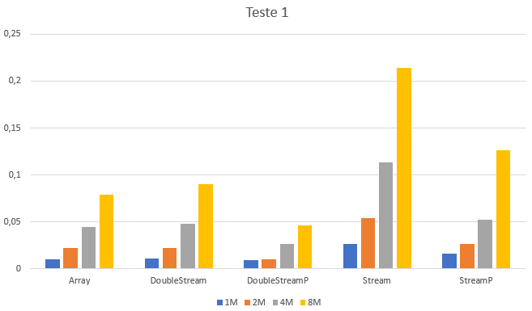

## Cálculo dos valores de transações registadas

### Observações

Este teste recebe como input uma coleção de transações.

### Métodos a testar

```{.java caption="Cálculo da soma dos valores das transações atraveś de um array do tipo double"}
public double sumArray() {
    double[] values = new double[this.transactions.size()];
    int i = 0;

    for (TransCaixa transaction : this.transactions) {
        values[i++] = transaction.getValor();
    }

    double sum = 0.0;

    for (i = 0; i < values.length; i++) {
        sum += values[i];
    }

    return sum;
}
```

```{.java caption="Cálculo da soma dos valores das transações através de uma DoubleStream"}
public double sumDoubleStream() {
    DoubleStream values = this.transactions.stream()
        .mapToDouble(TransCaixa::getValor);
    return values.sum();
}

public double sumDoubleStreamP() {
    DoubleStream values = this.transactions.parallelStream()
        .mapToDouble(TransCaixa::getValor);
    return values.sum();
}
```

```{.java caption="Cálculo da soma dos valores das transações através de Stream<Double>"}
public double sumStream() {
    Stream<Double> values = this.transactions.stream()
        .map(TransCaixa::getValor);
    return values.reduce(0.0, (a,b) -> a + b);
}

public double sumStreamP() {
    Stream<Double> values = this.transactions.parallelStream()
        .map(TransCaixa::getValor);
    return values.reduce(0.0, (a,b) -> a + b);
}
```


### Resultados

```table
---
include: t01.csv
---
```



### Análise e conclusões

Após uma breve observação dos gráficos, podemos afirmar que a estrutura de dados
mais adequada é de facto a *DoubleStreamP* que implementa streams paralelas.
Em contraste, a pior estrutura em nível de performance é a *Stream*, sendo até 5
vezes mais lenta que a *DoubleStreamP*.

