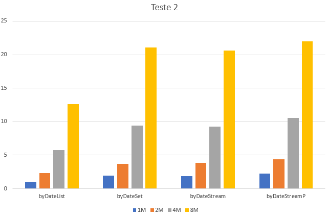

## Extração dos primeiros e últimos 20% de transações realizadas

### Observações

Este teste recebe como input uma coleção de transações.

### Métodos a testar

```{.java}
public SimpleEntry<List<TransCaixa>, List<TransCaixa>> byDateList() {
    int nelems = 20 * this.transactions.size() / 100;

    List<TransCaixa> sorted = new ArrayList<>(this.transactions);
    sorted.sort(Comparator.comparing(TransCaixa::getData));

    List<TransCaixa> first = sorted.subList(0, nelems);
    List<TransCaixa> last = sorted.subList(
            sorted.size() - 1 - nelems, sorted.size() - 1);

    return new SimpleEntry<>(first, last);
}
```

```{.java}
public SimpleEntry<List<TransCaixa>, List<TransCaixa>> byDateSet() {
    int nelems = 20 * this.transactions.size() / 100;

    TreeSet<TransCaixa> sorted = new TreeSet<>(
        // Com este comparador garante-se que a lista fica ordenada
        // e nao se removem os elementos iguais
        (t1, t2) -> t1.getData().isBefore(t2.getData()) ? -1 : 1
    );
    sorted.addAll(this.transactions);

    List<TransCaixa> first = new ArrayList<>(sorted)
            .subList(0, nelems);
    List<TransCaixa> last = new ArrayList<>(sorted.descendingSet())
            .subList(0, nelems);

    return new SimpleEntry<>(first, last);
}
```

```{.java}
public SimpleEntry<List<TransCaixa>, List<TransCaixa>> byDateStream() {
    int nelems = 20 * this.transactions.size() / 100;

    List<TransCaixa> first = this.transactions.stream()
            .sorted(Comparator.comparing(TransCaixa::getData))
            .limit(nelems)
            .collect(Collectors.toList());
    List<TransCaixa> last = this.transactions.stream()
            .sorted((t1, t2) -> t2.getData().compareTo(t1.getData()))
            .limit(nelems)
            .collect(Collectors.toList());

    return new SimpleEntry<>(first, last);
}
```

```{.java}
public SimpleEntry<List<TransCaixa>, List<TransCaixa>> byDateStreamP() {
    int nelems = 20 * this.transactions.size() / 100;

    List<TransCaixa> first = this.transactions.stream()
            .sorted(Comparator.comparing(TransCaixa::getData))
            .limit(nelems)
            .collect(Collectors.toList());
    List<TransCaixa> last = this.transactions.stream()
            .sorted((t1, t2) -> t2.getData().compareTo(t1.getData()))
            .limit(nelems)
            .collect(Collectors.toList());

    return new SimpleEntry<>(first, last);
}
```


### Resultados

```table
---
include: t02.csv
---
```




### Análise e conclusões

Após uma breve análise do gráfico podemos concluir que a implementação usando *List* é a mais rápida por uma margem substancial (quase 2x mais rápida que as outras alternativas implementadas).
Curiosamente a implementação paralela utilizando Streams, *byDateStreamP* é mais lenta que a sua implementação sequencial, *byDateStream*.
Podemos concluir que para os dataset fornecido a paralelização não é benéfica, antes pelo contrário.
Por fim, a implementação usando Sets e Streams sequenciais têm performance quase idênticas, sendo a sua diferença em tempos de execução na casa dos 5%.

