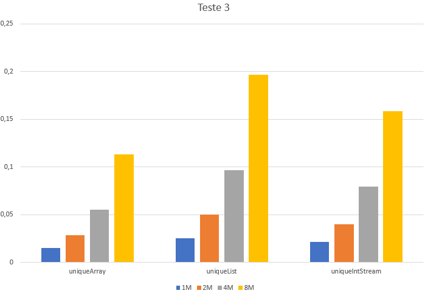

## Esforço de eliminação de duplicados

### Observações

### Métodos a testar

```{.java caption="Eliminação dos duplicados através de um array de inteiros"}
public Integer[] uniqueArray() {
    Set<Integer> nodups = new HashSet<>();
    for (int value : this.values) {
        nodups.add(value);
    }

    return nodups.toArray(new Integer[nodups.size()]);
}
```

```{.java caption="Eliminação dos duplicados através de uma lista de inteiros"}
public Integer[] uniqueList() {
    List<Integer> aux = new ArrayList<>();
    for (int value : this.values) {
        aux.add(value);
    }

    List<Integer> nodups = new ArrayList<>(new HashSet<>(aux));
    return nodups.toArray(new Integer[nodups.size()]);
}
```

```{.java caption="Eliminação dos duplicados através de uma stream de inteiros"}
public int[] uniqueIntStream() {
    IntStream values = new Random().ints(this.values.length, 0, 9999);
    return values.distinct().toArray();
}
```

\newpage

### Resultados

```table
---
include: t03.csv
---
```



\newpage

### Análise e conclusões

Após a respetiva geração de 1, 2, 4 ou 8 milhões de números aleatórios compreendidos entre 1 e 9999, procedemos à remoção dos elementos duplicados.
A alternativa mais viável para tal feito demonstrou tratar-se do *uniqueArray* que utiliza um *HashSet* como estrutura auxiliar.
A segunda melhor alternativa seria a *uniqueStream* que utiliza o operando *distinct()* seguindo de uma coleção para array.
Em último lugar vem a *uniqueList*, que embora também use um *HashSet* como estrutura auxiliar como o *uniqueArray* tem uma performance muito pior, tal que o tempo de execução do *uniqueArray* para 8 milhões de números aleatórios é igual ao tempo de execução do *uniqueList* para 4 milhões.

\newpage