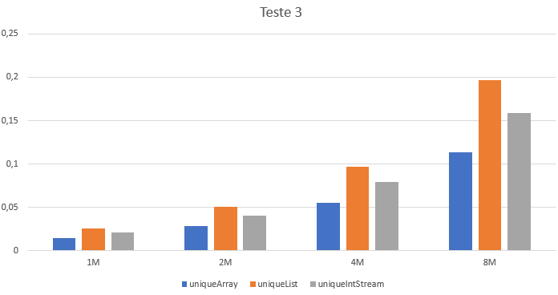

## Esforço de eliminação de duplicados

### Observações

### Métodos a testar

```{.java caption="Eliminação dos duplicados através de um array de inteiros"}
public Integer[] uniqueArray() {
    Set<Integer> nodups = new TreeSet<>();
    for (int value : this.values) {
        nodups.add(value);
    }

    return nodups.toArray(new Integer[nodups.size()]);
}
```

```{.java caption="Eliminação dos duplicados através de uma lista de inteiros"}
public Integer[] uniqueList() {
    List<Integer> aux = new ArrayList<>();
    for (int value : this.values) {
        aux.add(value);
    }

    List<Integer> nodups = new ArrayList<>(new HashSet<>(aux));
    return nodups.toArray(new Integer[nodups.size()]);
}
```

```{.java caption="Eliminação dos duplicados através de uma stream de inteiros"}
public int[] uniqueIntStream() {
    IntStream values = new Random().ints(this.values.length, 0, 9999);
    return values.distinct().toArray();
}
```

### Resultados

```table
---
include: t03.csv
---
```

### Análise e conclusões


