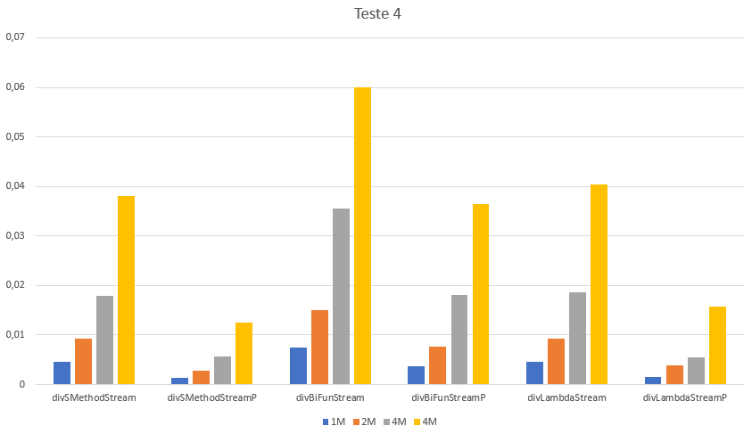

## Comparação entre a aplicação de método estático, BiFunction e Lambda

### Observações

### Métodos a testar

```{.java caption="Divisão de todos os números por 2 através de um método estático"}
public static int div(int x, int y) {
    return x / y;
}

public int[] divSMethodStream() {
    return Arrays.stream(this.values)
        .map(x -> div(x, 2)).toArray();
}

public int[] divSMethodStreamP() {
    return Arrays.stream(this.values).parallel()
        .map(x -> div(x, 2)).toArray();
}
```

```{.java caption="Divisão de todos os números por 2 através de uma BiFunction"}
public int[] divBiFunStream() {
    BiFunction<Integer, Integer, Integer> f = (x, y) -> x / y;
    return Arrays.stream(this.values)
        .map(x -> f.apply(x, 2)).toArray();
}

public int[] divBiFunStreamP() {
    BiFunction<Integer, Integer, Integer> f = (x, y) -> x / y;
    return Arrays.stream(this.values).parallel()
        .map(x -> f.apply(x, 2)).toArray();
}
```

```{.java caption="Divisão de todos os números por 2 através de um Lambda"}
public int[] divLambdaStream() {
    return Arrays.stream(this.values).map(x -> x / 2).toArray();
}

public int[] divLambdaStreamP() {
    return Arrays.stream(this.values).parallel().map(x -> x / 2).toArray();
}
```

\newpage

### Resultados

```table
---
include: t04.csv
---
```



\newpage

### Análise e conclusões

Embora neste dataset todos os métodos tenham uma performance excelente, na casa das centésimas de segundo, embora a implementação do *divSMethodStreamP* e *divLambdaStreamP* sejam as melhores, sendo a sua performance idêntica (diferenças na casa das milésimas de segundo).
O pior método de implementação trata-se da *divBiFunStream* que utiliza uma *BiFunction* para o cálculo da metade do número em causa.

\newpage