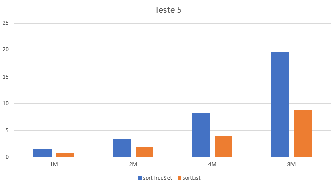

## Comparação da ordenação através de um TreeSet e do método `sorted`

### Observações

### Métodos a testar

```{.java caption="Ordenação através de um TreeSet"}
public TreeSet<TransCaixa> sortTreeSet() {
    Comparator<TransCaixa> byDate =
        // Com este comparador garante-se que a lista fica ordenada
        // e nao se removem os elementos iguais
        (t1, t2) -> t1.getData().isBefore(t2.getData()) ? -1 : 1;

    return this.transactions.stream()
        .collect(Collectors.toCollection(
                 () -> new TreeSet<>(byDate)));
}
```

```{.java caption="Ordenação através do método sorted"}
public List<TransCaixa> sortList() {
    Comparator<TransCaixa> byDate =
        Comparator.comparing(TransCaixa::getData);

    return this.transactions.stream()
        .sorted(byDate).collect(Collectors.toList());
}
```


### Resultados

```table
---
include: t05.csv
---
```

### Análise e conclusões


