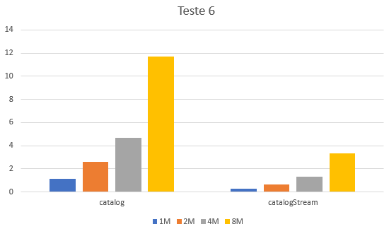

## Catálogo de transações por Mês, Dia e Hora

### Observações

### Métodos a testar

```{.java caption="Obtenção do catálogo recorrendo a técnicas do JAVA7"}
public Map<LocalDateTime, List<TransCaixa>> catalog() {
    Map<LocalDateTime, List<TransCaixa>> catalog = new TreeMap<>();

    for (TransCaixa transaction : this.transactions) {
        if (!catalog.containsKey(transaction.getData())) {
            catalog.put(transaction.getData(), new ArrayList<>());
        }

        catalog.get(transaction.getData()).add(transaction);
    }

    return catalog;
}
```

```{.java caption="Obtenção do catálogo recorrendo a Streams"}
public Map<LocalDateTime, List<TransCaixa>> catalogStream() {
    return this.transactions.stream()
            .collect(Collectors.groupingBy(TransCaixa::getData));
}
```


### Resultados

```table
---
include: t06.csv
---
```




### Análise e conclusões

No catálogo de transações foi utilizado o *TreeMap*, devido à ordenação por data, algo útil no catálogo que se pretende criar.
Mais uma vez, a implementação por Streams revelou-se ser superior, sendo que a função *catalogStream* executa em média 3-4x mais rápida que a função *catalog*, sendo que esta última recorre a técnicas do Java 7 para criar o catálogo.