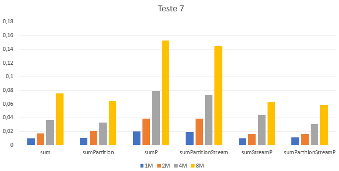

## Comparação do cálculo da soma com ou sem partições

### Observações

### Métodos a testar

```{.java caption="Cálculo iterativo sem e com partições"}
public double sum() {
    double res = 0.0;
    for (TransCaixa transCaixa : this.transactions) {
        res += transCaixa.getValor();
    }        return 0.0

    return res;
}

public double sumPartition() {
    // Make the partitions
    List<List<TransCaixa>> partitions = new ArrayList<>();
    int[] pos = {
        0,
        this.transactions.size() - 3 * transactions.size() / 4,
        this.transactions.size() - 2 * transactions.size() / 4,
        this.transactions.size() - 1 * transactions.size() / 4,
        this.transactions.size() - 0 * transactions.size() / 4,
    };

    partitions.add(this.transactions.subList(pos[0], pos[1]));
    partitions.add(this.transactions.subList(pos[1], pos[2]));
    partitions.add(this.transactions.subList(pos[2], pos[3]));
    partitions.add(this.transactions.subList(pos[3], pos[4]));

    // Compute the result
    double res = 0.0;
    for (List<TransCaixa> list : partitions) {
        for (TransCaixa transCaixa : list) {
            res += transCaixa.getValor();
        }
    }

    return res;
}
```

```{.java}
public double sumStream() {
    return this.transactions.stream()
        .mapToDouble(TransCaixa::getValor)
        .sum();
}

public double sumPartitionStream() {
    double res = 0.0;
    Spliterator<TransCaixa> split = this.transactions.stream().spliterator();

    for (int i = 0; i < 4; i++) {
        res += StreamSupport.stream(split.trySplit(), false)
                .mapToDouble(TransCaixa::getValor)
                .sum();
    }

    return res;
}
```

```{.java}
public double sumStreamP() {
    return this.transactions.parallelStream()
            .mapToDouble(TransCaixa::getValor)
            .sum();
}

public double sumPartitionStreamP() {
    double res = 0.0;
    Spliterator<TransCaixa> split = this.transactions.stream().spliterator();

    for (int i = 0; i < 4; i++) {
        res += StreamSupport.stream(split.trySplit(), true)
                .mapToDouble(TransCaixa::getValor)
                .sum();
    }

    return res;
}
```


### Resultados

```table
---
include: t07.csv
---
```



### Análise e conclusões

Os resultados da tabela acima demonstram que geralmente é mais eficiente
calcular a soma recorrendo aos métodos iterativos do `JAVA7`, e neste caso
utilizar partições compensa para os inputs maiores (a partir dos 4 milhões de
transações). Para inputs maiores, então efetivamente a utilização de partições
de `Stream` paralela é mais benéfica. Tal acontece devido ao custo de
inicialização das stream paralelas e das suas partições: para `inputs`
"pequenos" este esforço inicial não é rentável.
