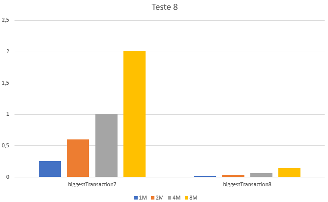

## Determinação da maior transação entre uma determinada hora

### Observações

### Métodos a testar

```{.java caption="Determinação da maior transação entre uma determinada hora
                   apenas com funcionalidades do JAVA7"}
String biggestTransaction7() {
    List<TransCaixa> transactions = new ArrayList<>(this.transactions);

    transactions.sort(new Comparator<TransCaixa>() {
        @Override
        public int compare(TransCaixa t1, TransCaixa t2) {
            return Double.compare(t1.getValor(), t2.getValor());
        }
    });

    for (TransCaixa transaction : transactions) {
        int hour = transaction.getData().getHour();

        if (hour >= 16 && hour <= 20) {
            return transaction.getTrans();
        }
    }

    return null;
}
```

```{.java caption="Determinação da maior transação entre uma determinada hora
                   com auxílio de Streams"}
Optional<String> biggestTransaction8() {
    t.getData().getHour() >= 16 && t.getData().getHour() <= 20;

    return this.transactions.stream()
        .filter(timeInRange)
        .max(Comparator.comparing(TransCaixa::getValor))
        .map(TransCaixa::getTrans);
}
```

\newpage

### Resultados

```table
---
include: t08.csv
---
```



\newpage

### Análise e conclusões

\newpage