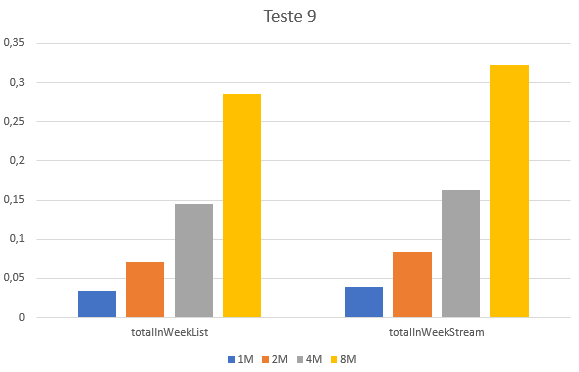

## Cálculo do total facturado numa determinada semana do ano

### Observações

### Métodos a testar

```{.java caption="Cálculo do total facturado na semana 12 do ano"}
public double totalInWeekList() {
    final int week = 12;
    List<List<TransCaixa>> byWeek = new ArrayList<>();

    // Inicializar cada uma das listas
    for (int i = 0; i < 54; i++) {
        byWeek.add(i, new ArrayList<>());
    }

    for (TransCaixa transaction : this.transactions) {
        byWeek.get(transaction.getData()
                .get(ChronoField.ALIGNED_WEEK_OF_YEAR))
                .add(transaction);
    }

    // Calcular total faturado
    double total = 0.0;

    for (TransCaixa transaction : byWeek.get(week)) {
        total += transaction.getValor();
    }

    return total;
}
```

```{.java caption="Cálculo do total facturado na semana 12 do
                   ano com recurso a streams"}
public double totalInWeekStream() {
    final int week = 12;
    Map<Integer, List<TransCaixa>> byWeek = this.transactions.stream()
            .collect(Collectors.groupingBy(
                    t -> t.getData().get(ChronoField.ALIGNED_WEEK_OF_YEAR)));
    return byWeek.entrySet().stream()
            .filter(e -> e.getKey() == week)
            .findFirst()
            .map(e -> e.getValue().stream()
                .mapToDouble(TransCaixa::getValor).sum())
            .orElse(0.0);
}
```


### Resultados

```table
---
include: t09.csv
---
```




### Análise e conclusões

Os resultados deste teste surpreendem pelo facto de a `stream` codificada
ter uma *performance* ligeiramente pior que a sua versão iterativa. Tal deve-se
ao algoritmo utilizado na `stream`:  de forma a manter alguma legibilidade e
simplicidade no código, criou-se inicialmente um `Map` que associa uma semana
a um conjunto de transações, enquanto que a versão iterativa utilizou
simplesmente um `List` onde cada posição corresponde a uma semana do ano.
