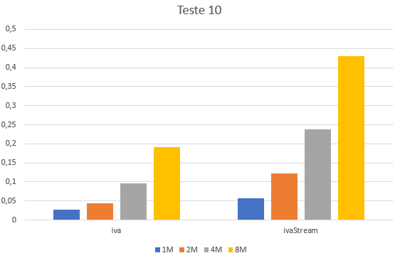

## Cálculo do total de IVA associado a cada mês

### Observações

### Métodos a testar

```{.java caption="Cálculo do total de IVA para cada mês"}
public List<Double> iva() {
    List<Double> ivas = new ArrayList<>(13);

    // Initialize the IVAS with 0
    for (int i = 0; i < 13; i++) {
        ivas.add(0.0);
    }

    for (TransCaixa transaction : this.transactions) {
        Month month = transaction.getData().getMonth();
        Double value = transaction.getValor();
        Double iva = value < 20               ? 0.15 * value :
                    (value > 20 && value < 20 ? 0.20 * value :
                                                0.23 * value);
        ivas.set(month.getValue(), ivas.get(month.getValue()) + iva);
    }

    return ivas;
}
```

```{.java caption="Cálculo do total de IVA para cada mês, com recurso a streams"}
public Map<Month, Double> ivaStream() {
    return this.transactions.stream()
            .collect(Collectors.groupingBy(t -> t.getData().getMonth()))
            .entrySet()
            .stream()
            .collect(Collectors.toMap(
                    Map.Entry::getKey,
                    e -> e.getValue().stream()
                            .mapToDouble(TransCaixa::getValor)
                            .map(x -> x < 20           ? 0.15 * x :
                                     (x > 20 && x < 20 ? 0.20 * x :
                                                         0.23 * x ))
                    .sum()
            ));
}  
```


### Resultados

```table
---
include: t10.csv
---
```




### Análise e conclusões

Tal como o teste anterior este é um dos poucos casos em que a codificação do
algoritmo numa única `stream` é mais complexa e menos eficiente.
O algoritmo iterativo utiliza uma `List` para armezanar os IVAs de cada mês,
onde cada posição corresponde a um mês do ano. Esta é pois a única estrutura
auxiliar utilizada, que vai sendo modificada, calculando-se pois o IVA em cada
mês através da soma do valor que já lá se encontrava com o atual. Já a versão
com `Stream` é um pouco mais complexa pois primeiro cria um `Map` onde associa
um mês a um conjunto de transações e só depois é que efetua a sua soma.
