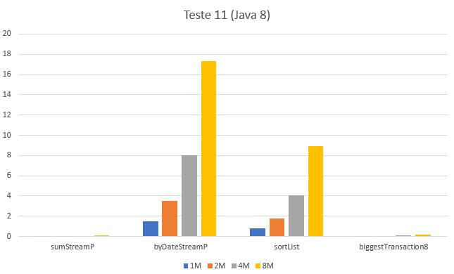
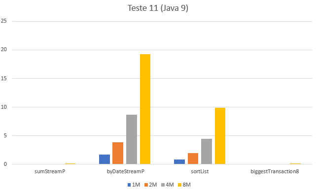

## Comparação de performance entre JDK8 e JDK9

### Observações

### Métodos a testar

Dos testes anteriores, foram selecionados os seguintes, que manipulam
conjuntos enormes de registos `TransCaixa`:

 - **byDateStream** do teste 4;
 - **sortList** do teste 4;
 - **biggestTransaction8** do teste 8;
 - **ivaStream** do teste 10;


### Resultados

```table
---
include: t11-j8.csv
---
```


```table
---
include: t11-j9.csv
---
```






### Análise e conclusões

