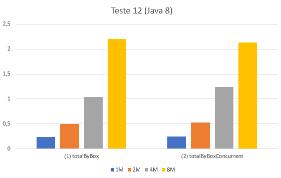
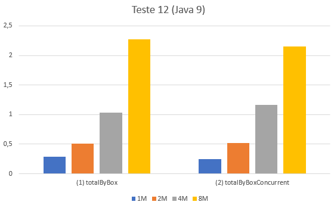

## Total faturado por caixa em Java 8 e Java 9

### Observações

### Métodos a testar

```{.java caption="Cálculo do total facturado por caixa em JAVA8"}
public Map<String, Double> totalByBox() {
        Map<String, Map<Month, List<TransCaixa>>> table = this.transactions
                .stream()
                .collect(Collectors.groupingBy(TransCaixa::getCaixa))
                .entrySet()
                .stream()
                .collect(Collectors.toMap(Map.Entry::getKey,
                        l -> l.getValue().stream()
                                .collect(Collectors.groupingBy(
                                        t -> t.getData().getMonth())
                                ))
                );

        return table.entrySet().stream()
                .collect(Collectors.toMap(
                        Map.Entry::getKey,
                        e -> e.getValue().values().stream()
                                .flatMap(Collection::stream)
                                .mapToDouble(TransCaixa::getValor)
                                .sum()));
    }
```

```{.java caption="Cálculo do total facturado por caixa em JAVA9"}
public Map<String, Double> totalByBoxConcurrentMap() {
        ConcurrentMap<String, Map<Month, List<TransCaixa>>> table = this.transactions
                .stream()
                .collect(Collectors.groupingBy(TransCaixa::getCaixa))
                .entrySet()
                .stream()
                .collect(Collectors.toConcurrentMap(Map.Entry::getKey,
                        l -> l.getValue().stream()
                                .collect(Collectors.groupingBy(
                                        t -> t.getData().getMonth())
                                ))
                );

        return table.entrySet().stream()
                .collect(Collectors.toConcurrentMap(
                        Map.Entry::getKey,
                        e -> e.getValue().values().stream()
                                .flatMap(Collection::stream)
                                .mapToDouble(TransCaixa::getValor)
                                .sum()));
}
```

### Resultados

```table
---
include: t12-j8.csv
---
```

```table
---
include: t12-j9.csv
---
```





\newpage

### Análise e conclusões

\newpage